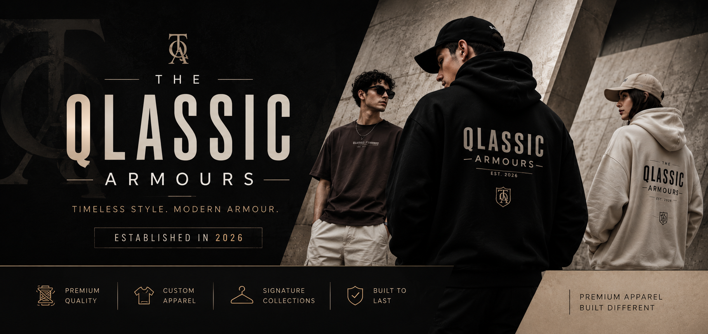

<div align="center">
  <br />
  <div align="center">
    
  </div>
  <br />
  <br />

  <div>
    
    
    
  </div>

  <h3 style="font-weight:700;font-size:30px;">
    Qlassic Armor — Premium Fashion Website
  </h3>

  <div>
    A modern and immersive fashion experience built with
    <b> ReactJS</b>, <b>Tailwind CSS</b>, and <b>GSAP</b>.
    Qlassic Armor combines timeless aesthetics with contemporary
    interactions to showcase custom apparel and signature collections.
  </div>
</div>

## 📋 <a name="table">Table of Contents</a>

1. 🚀 [Introduction](#introduction)
2. ⚙️ [Tech Stack](#tech-stack)
3. ✨ [Features](#features)
4. 🤸 [Quick Start](#quick-start)
5. 📂 [Project Structure](#project-structure)
6. 🖼️ [Assets](#assets)
7. 🌐 [About](#about)

## Introduction

Qlassic Armor is a premium clothing brand website focused on delivering a visually engaging and interactive experience. Built using **GSAP**, **React**, and **Tailwind CSS**, the project combines smooth animations, dynamic scrolling effects, and modern layouts to present collections, styles, and custom apparel solutions.

## Tech Stack

* ⚛️ React 19
* 🌀 Tailwind CSS v4
* 🎞️ GSAP (GreenSock Animation Platform)

## Features

* ✨ Smooth and immersive scrolling experience
* ⚡️ Advanced GSAP animations
* 🕹️ ScrollTrigger and ScrollSmoother integration
* 🎨 Premium typography and color palette
* 🧑‍💻 Animated text reveals and transitions
* 📱 Fully responsive and mobile-friendly
* 👕 Interactive fashion collection showcase
* 🌟 Signature style presentation sections

## Quick Start

```bash
# Clone the repository
git clone https://github.com/yourusername/qlassic-armor.git

# Install dependencies
npm install

# Start the development server
npm run dev

# Build for production
npm run build
```

## Project Structure

```text
src/
├── components/
├── constants/
├── sections/
├── App.jsx
└── main.jsx

public/
├── fonts/
├── images/
└── videos/
```

## Assets

* 🎥 Promotional and background videos
* 🖼️ Brand imagery and design elements
* 🔤 Custom typography
* 🎨 Fashion-inspired visual assets

## About

Qlassic Armor is dedicated to blending timeless craftsmanship with modern style. From custom-made apparel to signature ready-to-wear collections, the brand aims to deliver quality, individuality, and confidence through every design.

---

<p align="center">
Made with React, Tailwind CSS, and GSAP.
</p>
